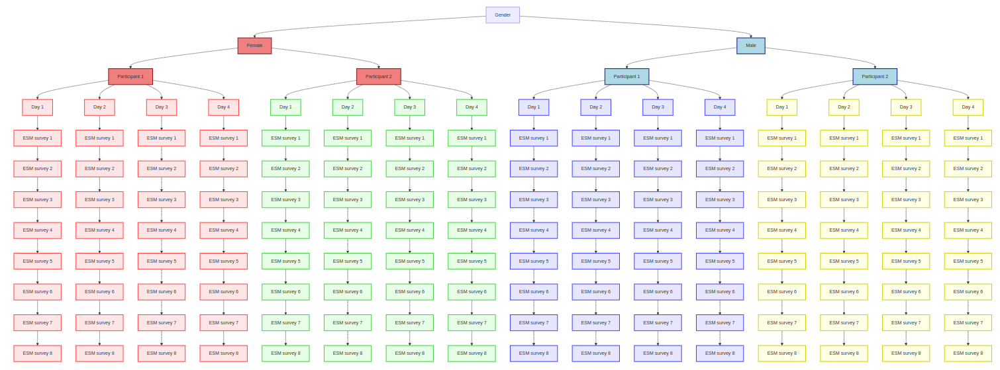

<br>

------------------------------------------------------------------------

::: {.alert .alert-warning}
<strong>Note:</strong> if you open this notebook in an IDE like RStudio, please make sure to set the working directory to the folder where this notebook is located. Otherwise, the code will not work as intended.
:::

# Purpose of this notebook

This notebook is intended to make you familiar with processing and analyzing smartphone survey data in `R`. It uses data exported from a demo survey on Emotionality and Social Interaction, which was conducted with the GESIS AppKit 🐿️. The data is available in the `data` folder of this repository.

The main goal of this notebook is to make the user familiar with importing, cleaning and inspecting the data. It also includes some basic graphical representations of the data.

The notebook is not intended to be a comprehensive guide to smartphone survey data analysis, but rather a starting point for further exploration and analysis.

------------------------------------------------------------------------

<br><br><br>

# Introduction

The demo study in this notebook is intended to replicate the findings of the study by [Barrett et al. (2010)](https://doi.org/10.1080/026999398379565) on emotionality and social interaction, which looks at the self-reported emotionality of individuals and differences between men and women. The study's main finding:

> We predicted and found that sex-related differences in emotion in global self-descriptions, but not in the averaged momentary ratings of emotion.

The study consisted of the following survey:

-   An entry survey distributed to participants after they logged into the study on the AppKit app.
-   A momentary assessment survey that was sent to participants at 8 random times during the day for a period of 4 days.
-   An exit survey that was distributed to participants after momentary assessment period.

You can find more information on the GESIS AppKit and request your own account on the [GESIS AppKit website](http://appkit.gesis.org/). You can also find detailed documentation on how to use the AppKit [here](https://appkit.gesis.org/manual/)

------------------------------------------------------------------------

<br><br><br>

# Data processing

## Setup

In order to run the code in this notebook, you need to install and load the following packages:

```{r, include=TRUE, echo=TRUE, output=FALSE, message=FALSE}

# List of required packages
packages <- c("ggplot2",
              "anytime",
              "dplyr",
              "psych",
              "corrplot",
              "cli",
              "lubridate",
              "tidyverse",
              "ggpubr",
              "withr")

# Check if each package is installed and install if missing
for (package in packages) {
  if (!require(package, character.only = TRUE, quietly = TRUE)) {
    message(paste("Installing package:", package))
    install.packages(package, repos = "https://cloud.r-project.org/")
    library(package, character.only = TRUE)
  } else {
    message(paste("Package", package, "is already loaded"))
  }
}

message("All required packages are now installed and loaded")


```

We will also load some convenience functions tailored to working with AppKit data. If you want to check out the code, you can find it in the `appkit_helpers.R` file.

```{r, include=TRUE, echo=TRUE, message=FALSE}

source("appkit_helpers.R")

```

## Importing and auto-formatting data

With the helper functions loaded, we can go ahead and use them to import the data.

The data are being read from the `data` folder. The `read_appkit_surveys()` function will automatically read all `.csv` files in the specified folder and combine them into a single data frame. The resulting data frame will contain all the survey responses, including the metadata (e.g., participant ID, survey ID, etc.) and the actual survey responses.

```{r}
surveys <- read_appkit_surveys('data', na_value = -1)
```

Let's take a look at the survey contained in the `surveys` list.

```{r}
# Check the names of the surveys
names(surveys)

```

As you can see, the `surveys` list contains three surveys. The first one contains the momentary assessment surveys for each participant, while the second and third ones are the pre- and post-surveys, entry and exit surveys, respectively.

To make things easier, let's assign the surveys to their own objects:

```{r}
entry <- surveys$entry_survey
ma <- surveys$momentary_assessment
exit <- surveys$exit_survey
```

Let's inspect each of the surveys in turn. We will start with the entry survey.

------------------------------------------------------------------------

<br><br><br>

# Entry Survey

Let's check the contained variables first.

```{r}
glimpse(entry)
```

We can see that the entry survey contains `r NROW(entry)` rows and `r NCOL(entry)` columns. This indicates that there are `r NROW(entry)` participants and `r NCOL(entry)` questions in the entry survey.

The first few variables contain metadata on the participant and their device:

-   `personalParticipantCode` Used to identify the participant in the study.
-   `generalLoginCode` Stores the general login code shared among participants to participate in the study.
-   `committed` Timestamp indicating when the participant's response was committed.
-   `scheduled` Timestamp indicating when the survey was scheduled for the participant.
-   `published` Timestamp indicating when the survey was set to published in the AppKit backend.
-   `osVersion` Holds information about the participant's operating system version.
-   `smartphoneType` Describes the participant's smartphone or device type

We can use this metadata to get an overview of who participated in your study on what devices.

<br>

## Devices and Operating Systems

```{r}
table(entry$osVersion, entry$smartphoneType, useNA = "always")
```

Looks like we have 2 users on recent versions of Android and 5 iPhone users on iOS 18.3.1. Luckily, we have no hackers running Android on their iPhones in our sample.

We can, of course, also visualize this information. Let's create a bar plot showing the number of participants per smartphone type and operating system version.

```{r}
ggplot(entry, aes(x = osVersion, fill = smartphoneType)) +
  geom_bar(position = "dodge") +
  labs(title = "Operating Systems by Smartphone Type",
       x = "OS Version",
       y = "Count",
       fill = "Smartphone Type") +
  theme_minimal() +
  theme(axis.text.x = element_text(angle = 45, hjust = 1))

```

Now that we've established our participants' mobile computing environment, let's take a look at the other variables contained in our entry survey. For this we will rely on a function from our AppKit helpers file.

```{r}
explore_vars(entry)
```

We can see that each variable has an assigned label as well as value labels for the response options.

Before we dive in deeper, let's get a good overview of our sample, let's look at some demographics, starting with sex and gender.

<br>

## Demographics

```{r}
# participant gender
table(entry$gender, useNA = "always")

# participant sex
table(entry$sex, useNA = "always")

# Sex by Gender
table(entry$gender, entry$sex, useNA = "always")
```

In light of the small sample size, let's roll with `gender` as our main variable of interest.

How old are our participants? Let's take a look at the age distribution.

```{r}
summary(entry$age)

#boxplot
ggplot(entry, aes(y = age)) +
  geom_boxplot() +
  labs(title = "Participant Age",
       y = "Participant Age") +
  theme_minimal()

# histogram
ggplot(entry, aes(x = age)) + 
  geom_histogram(binwidth = 1, color = "black", fill = "steelblue") +
  labs(title = "Participant Age Distribution",
       x = "Participant Age",
       y = "Count") +
  theme_minimal()

```

Looks like we're covering quite a bit of ground!

<br>

## Affect Intensity Measure (AIM)

In the entry survey, we are administering the 20-item version of the [Affect Intensitiy Measure (AIM)](https://labs.psychology.illinois.edu/~ediener/AIM.html). The AIM scale is a self-report measure of the intensity of emotional experience. Participants are asked to rate the intensity of their emotional experience on a 7-point Likert-scale ranging from 1 (never) to 7 (always). The AIM scale consists of 20 items, the 10 items representing low emotional intensity are reverse-coded.

First, lets have a look at the data.

```{r}
# processing AIM20 scale https://labs.psychology.illinois.edu/~ediener/AIM.html
entry[,8:27]

```

Let's check which questions need to be reverse coded.

```{r}
# print question labels of AIM items
aim_indices <- 8:27 # AIM items are in columns 8 to 27

# Extract aim data
aim_data <- entry[, aim_indices]

sapply(aim_data, function(x) attr(x, "label"))


```

As we can see from, we need to reverse code the following items: `1, 4, 6, 11, 12, 13, 14, 15, 17, 20`. Let's take a look at the data again for these variables and recode them

```{r}
# get rid of the labels, keep only numeric values
aim_data <- sapply(aim_data,as.numeric)

# reverse-coding items (columns 1,4,6,11,12,13,14,15,17,20)
reverse_items <- c(1, 4, 6, 11, 12, 13, 14, 15, 17, 20)

# Reverse code the specified items in a loop
for (item in reverse_items) {
  aim_data[, item] <- reverse.code(items = aim_data[, item], keys= -1, mini = 1, maxi = 7)
}


```

Now that we have reverse-coded the correct items, we can calculate the overall sum score for the AIM scale.

```{r}
# summary scores
aim_score <- rowSums(aim_data)/20

# attaching to dataframe
entry$aim_score <- aim_score

```

Let's take a look at the overall AIM score.

```{r}
# summary of AIM score
summary(entry$aim_score)

# table of AIM score by gender
table(entry$aim_score, entry$gender, useNA = "always")
```

Unfortunately, some participants did not answer all AIM items, which results in `NA` values in the AIM score, so we're back to one `female` participant.

Now that we do have an overall score, we can check out some basic plots and differences.

::: {.alert .alert-warning}
<strong>Note:</strong> Please keep in mind that the test data set we're working with has \< 10 respondents to give a good overview of the processing steps. The resulting plots and statistics will thus look a bit wonky and are in no way scientifically valid.
:::

<br>

### AIM by Gender

```{r, warning=FALSE}
# Aim score by gender
by(entry$aim_score, entry$gender, summary)

ggplot(entry, aes(x = gender, y = aim_score, fill = gender)) +
  geom_boxplot() +
  labs(title = "Side-by-Side Boxplot of Aim Score by Gender",
       x = "Gender",
       y = "Score") +
  theme_minimal() +
  scale_fill_brewer(palette = "Pastel1")

```

<br>

### AIM by Sex

```{r, warning=FALSE}
# Aim score by sex
by(entry$aim_score, entry$sex, summary)

ggplot(entry, aes(x = sex, y = aim_score, fill = sex)) +
  geom_boxplot() +
  labs(title = "Side-by-Side Boxplot of Aim Score by Sex",
       x = "Sex",
       y = "Score") +
  theme_minimal() +
  scale_fill_brewer(palette = "Pastel1")


```

<br>

### AIM by Age

```{r, warning=FALSE}
# Aim score by age
cor_test_results <- cor.test(entry$age, entry$aim_score)
print(cor_test_results)

ggplot(entry, aes(x = age, y = aim_score)) +
  geom_point() +
  geom_smooth(method = "lm", se = TRUE, color = "blue") +
  labs(title = "Scatterplot of Age by AIM score",
       x = "Age",
       y = "AIM score") +
  theme_minimal()

```

------------------------------------------------------------------------

<br><br><br>

# Momentary Assessment Survey

::: {.alert .alert-warning}
<strong>Note:</strong> Some of the plots in this and the following sections will not scale to real life studies with hundreds of participants, but are intended for illustrative purposes of the data and its structure in this particular data example.
:::

## Data Quality

With our insights from the entry survey in mind, we can dive into some descriptive analysis of our momentary assessment survey.

Let's start by examining the "main part" of our survey, the momentary assessment survey. We will start by looking at the variables contained in the survey. For this we will use the `explore_vars()` function from our AppKit helpers file again.

```{r}
explore_vars(ma)
```

As you can see, participants were asked about their interactions with others throughout the day and how they felt about them.

You can also see that the data structure is different from the entry survey. While the entry dataframe had one row per participant, the momentary assessment dataframe has multiple rows per participant. Lets check this

```{r}
table(ma$personalParticipantCode, useNA = "always")
```

We can see that we have a different number of rows per participant, one for each survey that the participant completed. This is because the same momentary assessment survey was sent out at *multiple* random times throughout the day.

Before we begin in with a more detailed analysis of the survey contents, let's assess how many of our participants actually completed the surveys. We know that each participant received 8 surveys per day over a period of 4 days, totaling 32 surveys. We can use the `personalParticipantCode` variable to group the data by participant and then count the number of surveys each participant completed.

::: {.alert .alert-warning}
<strong>Note:</strong> The survey datasets contain only committed responses, meaning that only the surveys that were actually answered by the participants are included in the dataset. This means that we can only count the number of surveys that were answered, not the number of surveys that were scheduled. Please note that this behavior might change in future version of the AppKit.
:::

```{r}
# Create a table of scheduled and committed surveys per participant
ma %>%
  group_by(personalParticipantCode) %>%
  summarise(
    scheduled = 4*8,
    committed = sum(!is.na(committed))
  ) %>%
  ungroup() %>%
  mutate(
    completion_rate = committed / scheduled * 100
  ) %>%
  arrange(desc(completion_rate)) %>%
  print(n = Inf)
```

We can also visualize the completion of the surveys by day to check if the compliance rate was constant or decreased over time. Keep in mind that not all participants started their 4-day survey window on the same day!

```{r, fig.height=20, fig.width=8, warning=FALSE, message=FALSE}

ma %>%
  mutate(scheduled = dmy_hms(scheduled),
         scheduled_day = as_date(scheduled)) %>%
  count(scheduled_day, personalParticipantCode) %>%
  ggplot(aes(x = scheduled_day, y = n)) +
  geom_line(linewidth = 1, color = "steelblue") +
  geom_point(size = 2, color = "steelblue") +
  facet_wrap(~ personalParticipantCode, ncol = 1) +
  scale_y_continuous(limits = c(0, 10), breaks = 0:10) +
  scale_x_date(date_breaks = "1 day", date_labels = "%d %b") +
  labs(title = "Entries over time (per participant)",
       x = "Scheduled date",
       y = "Number of submitted surveys") +
  theme_minimal() +
  theme(axis.text.x = element_text(angle = 45, hjust = 1))

```

Since the surveys were sent out at random, let's check when the surveys were sent and how long it took participants to respond.

First, let's visualize when the surveys were sent out. We will use the `scheduled` variable to plot the distribution of survey times.

```{r}
# Convert the time variables to POSIXct


# convert to time variables (note: with_locale is required here to ensure consistent parsing across locales!)
ma <- ma %>%
  mutate(
    scheduled = withr::with_locale(c("LC_TIME" = "C"), as.POSIXct(scheduled, format = "%d-%b-%Y %H:%M:%S")),
    committed = withr::with_locale(c("LC_TIME" = "C"), as.POSIXct(committed, format = "%d-%b-%Y %H:%M:%S")),
    published = withr::with_locale(c("LC_TIME" = "C"), as.POSIXct(published, format = "%d-%b-%Y %H:%M:%S"))
  )


# Create a histogram of the scheduled times
ggplot(ma, aes(x = scheduled)) +
  geom_histogram(binwidth = 3600, fill = "dodgerblue", color = "black") +
  labs(title = "Distribution of Scheduled Times",
       x = "Scheduled Time",
       y = "Count") +
  theme_minimal() +
  theme(axis.text.x = element_text(angle = 45, hjust = 1))


# Create a histogram of the committed times
ggplot(ma, aes(x = committed)) +
  geom_histogram(binwidth = 3600, fill = "forestgreen", color = "black") +
  labs(title = "Distribution of Committed Times",
       x = "Committed Time",
       y = "Count") +
  theme_minimal() +
  theme(axis.text.x = element_text(angle = 45, hjust = 1))

```

Seems like the distribution of scheduled and committed times is fairly similar, but we can't really tell from these plots, maybe we need a more advanced graphical representation.

```{r}
# Define a small vertical offset.
offset <- 0.2

# create plot
ma %>%
  mutate(
    personalParticipantCode = factor(personalParticipantCode),
    ppt_index = as.numeric(personalParticipantCode)
  ) %>%
  distinct(personalParticipantCode, ppt_index) -> ppt_map


ma %>%
  mutate(
    personalParticipantCode = factor(personalParticipantCode),
    ppt_index = as.numeric(personalParticipantCode)
  ) %>%
  ggplot() +
  geom_segment(aes(
    x = scheduled, xend = committed,
    y = ppt_index - offset, yend = ppt_index + offset
  ), color = "grey", linewidth = 1) +
  geom_point(aes(x = scheduled, y = ppt_index - offset),
             color = "blue", size = 3) +
  geom_point(aes(x = committed, y = ppt_index + offset),
             color = "green", size = 3) +
  scale_y_continuous(
    breaks = ppt_map$ppt_index,
    labels = ppt_map$personalParticipantCode
  ) +
  scale_x_datetime(
    date_breaks = "1 day",
    date_labels = "%d %b"
  ) +
  labs(
    title = "Scheduled and Committed Beeps per Participant",
    x = "Date",
    y = "Participant ID",
    caption = "\U1F535 Scheduled    \U1F7E2 Committed"
  ) +
  theme_minimal() +
  theme(
    axis.text.x = element_text(angle = 45, hjust = 1),
    axis.text.y = element_text(size = 8)
  )

```

We can also calculate time between the scheduled and committed times. This will give us a pretty good idea of how long it took participants to respond to the surveys on average.

```{r}
# Calculate the time difference in seconds
ma <- ma %>%
  mutate(
    time_diff = as.numeric(difftime(committed, scheduled, units = "secs"))
  )

ma %>%
        mutate(time_diff_min = time_diff / 60) %>%
        mutate(time_diff_hours = time_diff_min / 60) %>%
  ggplot(aes(x = personalParticipantCode, y = time_diff_hours)) +
  geom_boxplot(fill = "skyblue", outlier.color = "red") +
  labs(
    title = "Time Difference Distributions per Participant",
    x = "Participant Code",
    y = "Time Difference (h)"
  ) +
  theme_minimal() +
  theme(axis.text.x = element_text(angle = 45, hjust = 1))

```

On average, took participants `r round(mean(ma$time_diff/60/60, na.rm = TRUE), 2)` hours to respond to the surveys. The median time difference is `r round(median(ma$time_diff/60/60, na.rm = TRUE), 2)` hours. The maximum time difference is `r round(max(ma$time_diff/60/60, na.rm = TRUE), 2)` hours and the fastest response time was `r round(min(ma$time_diff, na.rm = TRUE), 2)` seconds.

We can also check the self-indicated time difference of participants from the reported social interaction and answering the survey

```{r}
# delay
#table(ma_interaction$personalParticipantCode, ma_interaction$delay)
#round(prop.table(table(ma_interaction$personalParticipantCode,
#ma_interaction$delay),margin = 1),2)

ggplot(ma, aes(x = personalParticipantCode, fill = delay)) +
  geom_bar() +
  labs(title = "Stacked Bar Graph of Participant Code and Delay",
       x = "Participant Code",
       y = "Count") +
  theme_minimal() +
  theme(axis.text.x = element_text(angle = 45, hjust = 1))
 
```

Yet, not all responses that were commited include a personal interaction and not all answers were given conscientiously. We can check how many interactions we can analyze by contrasting the `dataquality` variable, which indicates whether the response was given conscientiously, with the `screening` variable, which indicates whether the participant had an interaction with someone else.

```{r}
# Create a table of data quality and screening
ma %>%
  mutate(dataquality = ifelse(as.integer(dataquality) == 1, "Conscientious",
                              "Not Conscientious")) %>%
    mutate(screening = ifelse(as.integer(screening) == 1, "Interaction",
                              "No Interaction")) %>%
   select(dataquality, screening) %>%
    table(useNA = "always")
```

As a last check, we can explore during what time of the day participants were most likely to respond to the surveys. We can do this by extracting the hour from the `committed` variable and plotting the distribution of responses.

```{r}
ma %>%
  mutate(
    committed_hour = factor(format(committed, "%H"), levels = sprintf("%02d", 0:23))
  ) %>%
ggplot(aes(x = committed_hour)) +
  geom_bar(fill = "dodgerblue", color = "black") +
  labs(
    title = "Distribution of Committed Hours",
    x = "Hour of Day",
    y = "Count"
  ) +
  theme_minimal() +
  theme(axis.text.x = element_text(angle = 45, hjust = 1))

```

Let's check the emotionality of interactions from the `ma` dataframe.

<br>

## Removing Data

First, let's reduce the dataframe to the instances where people actually reported on a social interaction and were people indicated to answer the questions conscientiously.

```{r}
# subset dataframe to only include interactions
ma_interaction <- ma %>%
  filter(screening == TRUE)

```

```{r, fig.width= 12}
# How many beeps were answered conscientiously
table(ma_interaction$dataquality, ma_interaction$personalParticipantCode)


```

One person seemed to be on a different page, so let's remove these answers from the dataset. We will also remove all other non-conscientious answers, as we are only interested in the conscientious responses.

```{r}
# remove non-conscientious answers
ma_interaction <- ma_interaction[ma_interaction$dataquality == "I have answered the questions conscientiously",]
```

<br>

## Interactions

Let's first have a look at what kind of interactions participants report on with respect to group sizes and interaction partner gender.

```{r}
# partner gender
table(ma_interaction$partner_gender)
table(ma_interaction$personalParticipantCode, ma_interaction$partner_gender)
round(prop.table(table(ma_interaction$personalParticipantCode, ma_interaction$partner_gender),margin = 1),2)


ggplot(ma_interaction, aes(x = personalParticipantCode, fill = partner_gender)) +
  geom_bar() +
  labs(title = "Stacked Bar Graph of Participant Code and Partner Gender",
       x = "Participant Code",
       y = "Count") +
  theme_minimal() +
  theme(axis.text.x = element_text(angle = 45, hjust = 1))

```

```{r}
# Group size

summary(ma_interaction$groupsize, useNA = "never")

ma_interaction %>%
  ggplot(aes(x = personalParticipantCode, y = groupsize)) +
  geom_boxplot(fill = "skyblue", outlier.color = "red") +
  labs(
    title = "Group size Distributions per Participant",
    x = "Participant Code",
    y = "Group Size"
  ) +
  theme_minimal() +
  theme(axis.text.x = element_text(angle = 45, hjust = 1))

```

Seems like one person was in a group of 35000 people, which is quite a lot. Let's check the description of this interaction to see if it was a mistake or an actual interaction.

```{r}
ma_interaction$description[ma_interaction$groupsize > 1000]
```

Aha, they were in a stadium with 35000 people, so this is actually a valid interaction. Let's keep it in the dataset, but we can still remove the outliers for the boxplot to get a better overview of the group sizes.

```{r}
# Group size (excluding outliers)


ma_interaction[ma_interaction$groupsize <= 30,] %>%
  ggplot(aes(x = personalParticipantCode, y = groupsize)) +
  geom_boxplot(fill = "skyblue", outlier.color = "red") +
  labs(
    title = "Group size Distributions per Participant",
    x = "Participant Code",
    y = "Group Size"
  ) +
  theme_minimal() +
  theme(axis.text.x = element_text(angle = 45, hjust = 1))

```

Lets also check the reported duration of interactions.

```{r}
# duration
table(ma_interaction$duration, useNA = "no")
table(ma_interaction$personalParticipantCode, ma_interaction$duration)
round(prop.table(table(ma_interaction$personalParticipantCode, ma_interaction$duration),margin = 1),2)

ggplot(ma_interaction, aes(x = personalParticipantCode, fill = duration)) +
  geom_bar() +
  labs(title = "Stacked Bar Graph of Participant Code and duration",
       x = "Participant Code",
       y = "Count") +
  theme_minimal() +
  theme(axis.text.x = element_text(angle = 45, hjust = 1))
 
```

<br>


## Emotionality

Before we can now have a look at the reported emotional impact of the interactions, we still have to format missing values.

```{r}
# format non-responses for the emotionality variables

ma_interaction <- ma_interaction %>%
  mutate(across(14:25, ~ ifelse(. < 0, NA, .)))
```

Finally, let's check the emotionality of reported social interactions!

```{r, warning=FALSE}
# Interaction Features, grouped by personalParticipantCode
summary_by_ppt <- ma_interaction %>%
  pivot_longer(
    cols = c(interaction_quality,
             interaction_intimacy,
             interaction_control,
             interaction_intensity),
    names_to = "measure",
    values_to = "value"
  ) %>%
  group_by(personalParticipantCode, measure) %>%
  summarise(summary_stats = list(summary(value)), .groups = "drop") %>%
  unnest_wider(summary_stats)
#print(summary_by_ppt)

# All ppts
ma_interaction %>%
  pivot_longer(
    cols = c(interaction_quality, interaction_intimacy, interaction_control, interaction_intensity),
    names_to = "measure",
    values_to = "value"
  ) %>%
  ggplot(aes(x = measure, y = value, fill = measure)) +
  geom_boxplot() +
  labs(title = "Distribution of Interaction Measures (All Participants)",
       x = "Measure",
       y = "Value") +
  theme_minimal() +
  scale_fill_brewer(palette = "Set2") +
  theme(legend.position = "none")

```

```{r, warning=FALSE}
# Emotionality Features
summary_by_ppt <- ma_interaction %>%
  pivot_longer(
    cols = c(emo_happy,
             emo_sad,
             emo_nervous,
             emo_surprise,
             emo_angry,
             emo_embarrassed,
             emo_ashamed),
    names_to = "measure",
    values_to = "value"
  ) %>%
  group_by(personalParticipantCode, measure) %>%
  summarise(summary_stats = list(summary(value)), .groups = "drop") %>%
  unnest_wider(summary_stats)
#print(summary_by_ppt)

# All ppts
ma_interaction %>%
  pivot_longer(
    cols = c(emo_happy,
             emo_sad,
             emo_nervous,
             emo_surprise,
             emo_angry,
             emo_embarrassed,
             emo_ashamed),
    names_to = "measure",
    values_to = "value"
  ) %>%
  ggplot(aes(x = measure, y = value, fill = measure)) +
  geom_boxplot() +
  labs(title = "Distribution of Emotion Measures (All Participants)",
       x = "Emotion Measure",
       y = "Value") +
  theme_minimal() +
  scale_fill_brewer(palette = "Set3") +
  theme(legend.position = "none",
        axis.text.x = element_text(angle = 45, hjust = 1))

```

------------------------------------------------------------------------

<br><br><br>


# Answering our research question

The question we wanted to investigate / replicate was based on this finding


> We predicted and found that sex-related differences in emotion in global self-descriptions, but not in the averaged momentary ratings of emotion.


After having explored both the global ratings of emotional intensity and the in-situ ratings of emotional intensity for social interactions, we can look at them in combination. To do so, we first need to combine the information from the entry survey (`gender`,`AIM score`) with the information from the momentary assessment (`interaction_intensity`).

```{r}
# we can combine the information of both dataframes into one
# dataframe to enable more sophisticated analyses
# to do so, we need to match the participant IDs and join the
# values from the entry long dataframe with the esm beeps.
# colnames(entry) # take over: committed, scheduled, published,
# aim_score, sex, gender, age
# colnames(ma) # keep all

# join entry survey
emotionality_study <- ma %>%
  left_join(entry %>% select(personalParticipantCode,
                             committed,
                             scheduled,
                             published,
                             aim_score,
                             gender,
                             sex,
                             age) %>%
                 rename(`committed_entry_survey` = committed,
               `scheduled_entry_survey` = scheduled,
               `published_entry_survey` = published,
               `committed_entry_survey` = committed),
               by = "personalParticipantCode")


```

<br>

## Global Emotional Intensity

First, let's check the 'global' emotional intensity of our participants, as measured by the AIM scale in the entry survey.

```{r, warning=FALSE}
# Aim score by gender
by(emotionality_study$aim_score, emotionality_study$gender, summary)

ggplot(emotionality_study, aes(x = gender,
                               y = aim_score,
                               fill = gender)) +
  geom_boxplot() +
  labs(title = "Side-by-Side Boxplot of Aim Score by Gender",
       x = "Gender",
       y = "Score") +
  theme_minimal() +
  scale_fill_brewer(palette = "Pastel1")

```

As in the original study, we can see that there are differences in the global emotional intensity scores between participants with different gender identities.

<br>

## In-situ Emotional Intensity

Now, let's check the in-situ emotional intensity of our participants, as measured by the `interaction_intensity` variable in the momentary assessment survey.

```{r, warning=FALSE}

by(emotionality_study$interaction_intensity, emotionality_study$gender, summary)


# overall diff plot
ggplot(emotionality_study, aes(x = gender, y = as.numeric(interaction_intensity), fill = gender)) +
  geom_boxplot() +
  scale_fill_manual(values = c("Female" = "lightcoral", "Male" = "lightblue")) +
  labs(
    title = "Interaction Intensity by Gender",
    x = "Gender",
    y = "Interaction Intensity"
  ) +
  theme_minimal()
```


Note that we have a nested structure of in-situ measurements with surveys nested in days, days nested in participants and participants nested in gender.

To compare male and female participants we need to aggregate the in-situ measurements to the participant level. We can do this by calculating the mean (or median) of the `interaction_intensity` for each participant and then averaging over the averages to generate overall scores.




::: {.alert .alert-warning}
<strong>Note:</strong> The better option to check data like these are true multilevel modeling approaches. However, these do not make sense with our small demo example.
:::


In order to compare participants, we will create a summary dataframe that contains the mean interaction intensity (the momentary measurement) for each participant.


```{r}
participant_summary <- emotionality_study %>%
  filter(!is.na(interaction_intensity), interaction_intensity != -1) %>%
  group_by(personalParticipantCode) %>%
  summarise(
    mean_interaction_intensity = mean(as.numeric(interaction_intensity), na.rm = TRUE),
    gender = first(gender),
    aim_score = first(aim_score)
  ) %>%
  ungroup()

participant_summary
```


Let's check the overall correlation between AIM and in-situ interaction intensitiy.


```{r, warning=FALSE, message = F}
ggplot(participant_summary, aes(x = aim_score, y = mean_interaction_intensity)) +
  geom_point() +
  geom_smooth(method = "lm", se = FALSE, color = "darkgray") +
  stat_cor(method = "pearson", label.x = 3, label.y = 4.5) +
  labs(
    title = "Correlation between AIM Score and Avg. Interaction Intensity",
    x = "AIM Score",
    y = "Mean Interaction Intensity"
  ) +
  theme_minimal()
```


The correlation coefficient between the AIM score and the mean interaction intensity is `r round(cor(participant_summary$aim_score, participant_summary$mean_interaction_intensity, use = "complete.obs"), 2)`, indicating a negative relationship between the two measures. The higher the AIM score, the lower the mean interaction intensity. However, we we can also see that the correlation coefficient is not significant, which means that we cannot conclude that there is a relationship between the two measures in our very small sample with only one participants identifying as `female`.


And finally, let's check the gender differences based on aggregated in-situ measurements.


```{r}
ggplot(participant_summary, aes(x = gender, y = mean_interaction_intensity, fill = gender)) +
  geom_boxplot() +
  scale_fill_manual(values = c("Female" = "lightcoral", "Male" = "lightblue")) +
  labs(
    title = "Average Interaction Intensity by Gender",
    x = "Gender",
    y = "Mean Interaction Intensity"
  ) +
  theme_minimal()
```


We can see that the differences in the mean interaction intensity between participants that we observed in the entry survey vanish in the momentary measure. This is in line with the findings of the original study, which found that there are no significant differences in the momentary ratings of emotion between participants with different genders.


# Other resources

-   The [ESM Preprocessing Gallery](https://preprocess.esmtools.com/) is a great resource for code snippets for working with momentary assessment data maintained by Jordan Revol and colleagues at KU Leuven.
-   Watch out for the `appkit` R package, which is currently in development and will provide a more convenient way to work with AppKit data in R.
